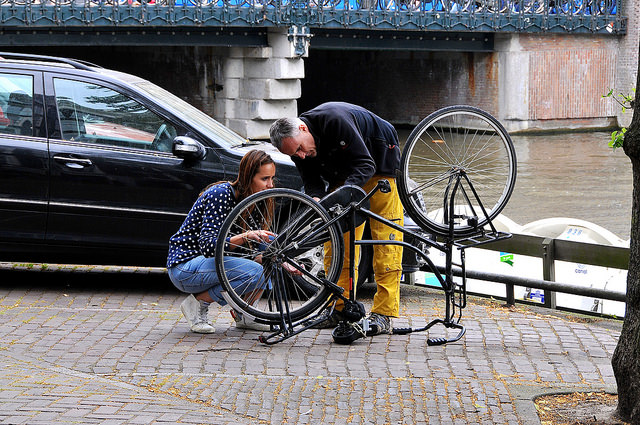

```{r setup, include=FALSE}
# knitr::opts_chunk$set(echo = FALSE)
```

# File formats and R

## Session information

> - ~1 hour session
> - 50:50 talking/practical split
> - learn about file formats and how to read/write them in R
> - often a key bottleneck if you're not used to R


## The history of storage devices

> - 1930s:  
> - 1960s: cassettes and hard discs
> - 1970s & 1980s: floppy discs
> - 1990s: CD ROMs
> - 2000s: SD cards, USBs, DVDs
> - 2010s: Cloud Backup Solutions

Source: [zetta.net](http://www.zetta.net/history-of-computer-storage/)

## The history of data formats

Human readable formats:

> - .csv: 1967
> - .json: 2001

Binary formats:

> - .xls
> - .sav
> - .Rdata

Databases

> - e.g. Postgres

## Why are data formats important?


> - Punchcards from 1959 (source: [Wikipedia](https://en.wikipedia.org/wiki/Punched_card))

## Getting to know your data

 

Source (cc licence): https://flic.kr/p/oJdg64

```{r, echo=FALSE}
# Note: the point here is that people don't usually think about formats until they break!
```


## What data formats do you use?


# Loading data in R

## Quick-fire example from the tutorial

```{r, eval=FALSE}
# write a .csv file to the screen
df <- cars[1:3,]
write.csv(x = df)
# save to file
write.csv(x = cars[1:3,], "data/minicars.csv")
df
```

```{r, echo=FALSE}
df <- cars[1:3,]
df
```

## Reading csv files

```{r, eval=FALSE}
df <- read.csv("data/minicars.csv")
df
```

```{r, echo=FALSE}
df <- read.csv("../data/minicars.csv")
# knitr::kable(df)
df
```

> **Quiz:** what happened to df?

## Writing without row names

```{r}
write.csv(df, row.names = F)
write.csv(cars[1:3,], row.names = F)
```

## Using external packages

- Often external packages are needed for optimal reading/writing

```{r}
readr::write_csv(cars[1:3,], "mini_readr.csv")
df <- read.csv("mini_readr.csv")
```

> **Quiz**: what is in df now?

> **Quiz**: what does `::` mean?

```{r, echo=FALSE}
# dim(df) == dim(cars[1:3,])
```

# Worked example - on screen

## The trusty csv

```{r}
people <- c("Colin", "Robin", "Rachel")
n_pets <- c(5, 2, 4)
df <- data.frame(people, n_pets)
# write.csv(df)
```

> - **Challenge:** Write to a csv file *without* saving row names

## Writing csv files to screen

```{r}
write.csv(df)
```

> **Challenge:** Write the file to disk

```{r, echo=FALSE}
write.csv(df, "pets.csv")
```

## R's own formats

- Saving to R's data format

> - `save()` with `.RData` extension (many objects, saves name)
> - `saveRDS()` with `.Rds` extension (one object, omits name)
> - `.Rda` is short for `.RData`

```{r}
df1 <- df
save(df, df1, file = "dfs.RData")
rm(df, df1)
ls()
```

> - Recommendation: use `.Rds` when space is an issue, otherwise .csv

## Loading R data

> - `load(filename.Rdata)`
> - `new_object <- readRDS('filename.Rds')`

> **Challenge:** Load the data saved in the previous stages

# Worked practical: work through chapter 3: 3.1 to 3.4 (30 minutes)

## First command (to run!) from chapter 3

```{r, eval=FALSE}
npi <- read.csv("data/miniaa")
dim(npi)
```

> - **Challenge:** What do the numbers mean?

## Excessive data output!

> - **Quiz:** how to stop the screen overflowing?

```{r, eval=FALSE}
npi
```


```{r, echo=FALSE}
npi <- read.csv("../data/miniaa")
dim(npi)
npi
```

# Freeing your data from spreadsheets

## readxl

Much of the world's data is trapped in inaccessible files

This section relies on the [readxl package](https://github.com/hadley/readxl)

```{r, eval=FALSE}
f <- "data/CAIT_Country_GHG_Emissions_-_All_Data.xlsx"
system.time(df <- readxl::read_excel(f, sheet = 4))
```

## Other packages for spreadsheets

```{r, eval=FALSE}
xls_pkgs <- c("gdata", "openxlsx", "reaODS")
# install.packages(xls_pkgs) # install packages if they're not already
# This took less than 0.1 seconds
system.time(df <- readxl::read_excel(f, sheet = 4))
# This took over 1 minute (make a coffee!)
system.time(df1 <- gdata::read.xls(f, sheet = 4))
# This took 20 seconds
system.time(df2 <- openxlsx::read.xlsx(f, sheet = 4))
```

## Different outputs

```{r, eval=FALSE}
# After saving the spreadsheet to .odt (not included) - took more than 1 minute
system.time(df3 <- readODS::read.ods("data/CAIT_Country_GHG_Emissions_-_All_Data.ods", sheet = 4))

head(df[1:5])
head(df1[1:5])
head(df2[1:5])
head(df3[1:5])
```

# Worked practical: 3.5 (10 minutes)

## Thanks for listening!s

