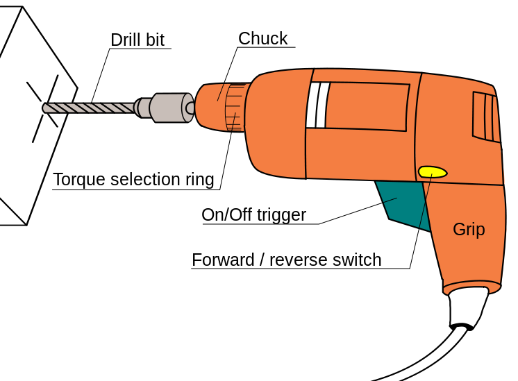

```{r echo=FALSE}
library("pryr")
library("grid")
library("png")
```

# Chapter 1: Overview

## Who?

  * Dr Colin Gillespie
    * Statistics Lecturer, Newcastle University
    * Research interest in high performance and parallel computing
  * Dr Robin Lovelace
    * Research Fellow, Leeds Institute for Data Analytics (LIDA)
    * Data processing and 'analytics', focus on geographical data and sustainable transport
    
## What is Big Data?

> - Number of rows (volume)?
> - Rate of build-up (velocity)?
> - Number of nested list items (variety)?

- **Example:** http://geo8.webarch.net/
> - Is this Big Data? 

## Software choices

Think of data processing as DIY




## Coping with big data in R

  * R has had a difficult relationship with big data
    * It loads data into the computer's RAM
  * This was less of a problem twenty years ago, 
    * Small data set
    * Main bottleneck  was thinking
  * Traditionally the development of a statistical model took more time than the computation. 
  * When it comes to big data, this changes.
  * Nowadays datasets that are larger than your laptop's memory are commonplace.

## Example: Clustering

  * Even if the original data set is relatively small data set, the analysis can generate large objects. 
  * For example, suppose we went to perform standard cluster analysis.
  * Using the built-in data set `USAarrests`, we can calculate a distance matrix,
```{r}
d = dist(USArrests)
```

## Example: Clustering

\noindent and perform hierarchical clustering to get a dendrogram

```{r}
fit = hclust(d)
```


```{r denofig.fullwidth=TRUE, fig.height=2, echo=FALSE, fig.cap="Dendrogram from USArrests data."}
par(mar=c(3,3,2,1), mgp=c(2,0.4,0), tck=-.01,cex=0.5, las=1)
plot(fit, labels=rownames(d))
```


## Example: Clustering

When we inspect the object size of the original data set and the distance object
```{r}
pryr::object_size(USArrests)
pryr::object_size(d)
```


## Example: Clustering

  * We have managed to create an object that is three times larger than the original data set
  * In fact the object `d` is a symmetric $n \times n$ matrix, where $n$ is the number of rows in `USAarrests`
  * As `n` increases the size of `d` increases at rate $O(n^2)$
  * So if our original data set contained $10,000$ records, the associated distance matrix would contain almost $10^8$ values. 

## Buy more RAM

  * Since R keeps all objects in memory, the easiest way to deal with memory issues. 
  * Currently, 16GB costs less than £100. 
  * This small cost is quickly recuperated on user time. 
  * A relatively powerful desktop machine can be purchased for less that £1000. 

## Cloud computing

  * Another alternative, could be to use cloud computing. 
  * For example, Amazon currently charge around £0.15 per Gigabyte of RAM. 
  * Currently, a $244$GB machine, with $32$ cores, costs around £3.12 per hour
  
## Sampling

  * Do you __really__ need to load all of data at once? 
  * For example, if your data contains information regarding sales, does it make sense to aggregate across countries, or should the data be split up? 
  * Assuming that you need to analyse all of your data, then random sampling could provide an easy way to perform your analysis. 
  * It's almost always sensible to sample your data set at the beginning of an analysis until your analysis pipeline is in reasonable shape.

## Sampling

  * If your dataset is too large to read into RAM, it may need to be
*preprocessed* or *filtered* using tools external to R before
reading it in. 
  * This is the topic of chapter 3 and 6

## Integration with C++ or Java

  * Move small parts of the program from R to another, faster language, such as C++ or Java. 
    * The goal is to keep R's neat way of handling data, with the higher performance offered by other languages. 
  * Many of R's base functions are written in C or Fortran. 
  * This outsourcing of code to another language can be easily hidden in another function. 

## Avoid storing objects in memory

  * There are packages available that avoid storing data in memory. 
    * Objects are stored on your hard disc and analysed in blocks or chunks. 
    * Hadoop is an example of this technique. 
  * This strategy is perfect for dealing with large amounts of data. 
  * Unfortunately, many algorithms haven't been designed with this principle in mind. 
  * This means that only a few R functions that have been explicitly created to deal with specific chunk data types will work.

## Alternative interpreters

  * Due to the popularity of R, it now possible to use alternative interpreters 
    * the interpreter is where the code is run

## pqr
  * [pqrR](http://www.pqr-project.org/) (pretty quick R) is a new version of the R interpreter. 
    * One major downside, is that it is based on R-2.15.0. 
  * The developer (Radford Neal) has made many improvements, some of which have now been incorporated into base R. 
  * __pqR__ is an open-source project licensed under the GPL. 
  * One notable improvement in pqR is that it is able to do some numeric computations in parallel with each other
  
## Renjin

  * [Renjin](http://www.renjin.org/) reimplements the R interpreter in Java, so it can run on the Java Virtual Machine (JVM)
  * Since R will be pure Java, it can run anywhere.

## Tibco

  * [Tibco](http://spotfire.tibco.com/) created a C++ based interpreter called TERR. 

## Oracle

  * Oracle also offer an R-interpreter, that uses Intel's mathematics library and therefore achieves a higher performance without changing R's core. 

## Course R package

  * There is companion R package for this course. 

    ```{r eval=FALSE}
    install.packages("drat")
    drat::addRepo("rcourses")
    install.packages("r4bd")
  ```


